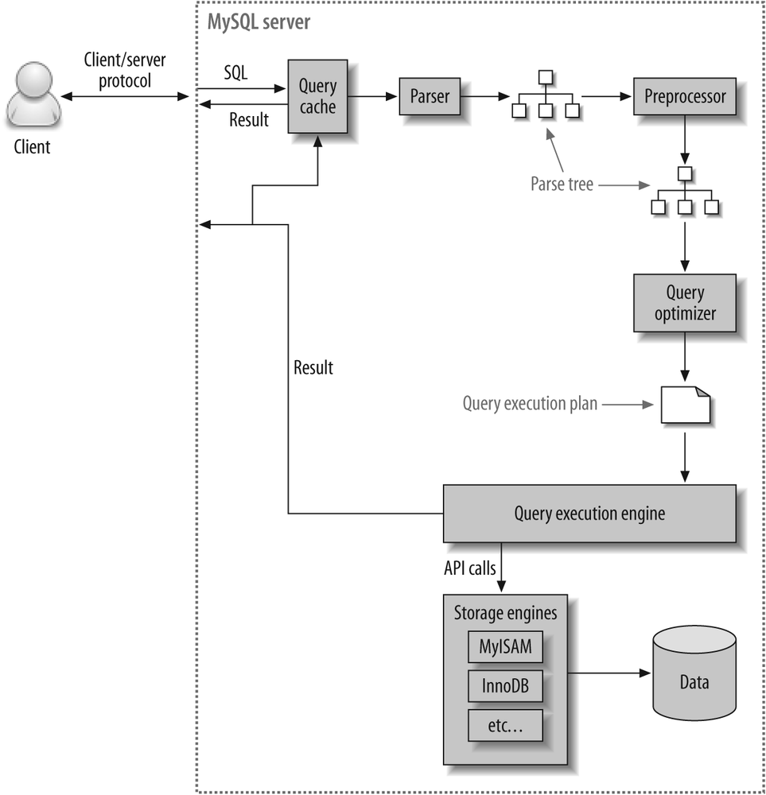

쿼리 실행 과정에서 제일 먼저 Query Cache를 방문하게 된다.

## 쿼리 캐시
- SQL 실행 결과를 메모리에 캐싱

- 동일 SQL 실행시 이전 결과를 즉시 반환

- 테이블의 데이터가 변경되면 캐싱된 데이터 삭제 필요

- 캐싱 데이터가 삭제될때마다 캐싱 데이터에 접근하는 Thread에 락이 걸리는데, 심각한 성능 저하를 일으켜서 MYSql 8.0부터는 삭제됐다.

## 쿼리 파서
쿼리 파서에는 어휘 스캐너와 문법규칙 모듈 두개로 이루어져 있다.

어휘 스캐너는 쿼리를 토큰으로 각각 분해하게 된다.

문법 규칙 모듈은 이 시퀀스를 생성하는 SQL 문법 규칙의 조합을 찾고 해당 규칙과 관련된 코드를 실행.

옵티마이저가 실행 할 수 있는 parse tree가 생성된다.

## 전처리기
- parse tree를 기반으로 문장 구조를 체크

- parse tree의 토큰이 유효한지 체크

## 옵티마이저
- SQL 실행을 최적화해서 실행 계획을 짬

- 규칙 기반 최적화 : 옵티마이저에 내장된 우선순위에 따라 실행 계획 수립

- 비용 기반 최적화 : 작업의 비용과 대상 테이블의 통계 정보를 활용해서 실행 계획 수립

## 쿼리 실행 엔진
- 옵티마이저가 만든 실행 계획대로 스토리지 엔진을 호출해서 레코드를 읽고 쓴다.
## 스토리지 엔진
- 쿼리 실행 엔진이 요청하는 대로 데이터를 저장하고 읽는다.

- 대표적으로 InnoDB , MyISAM 스토리지 엔진이있다.

- 핸들러 API에 의해 동작

- 핸들러라고도 불림

- 플러그인 형태로 제공

- 검색어 parser , 사용자 인증 모듈 등도 플러그인 형태로 제공

- 플러그인끼리는 통신이 불가능

- mysql 서버의 변수나 함수를 직접 호출해서 캡슐화를 위반한다.