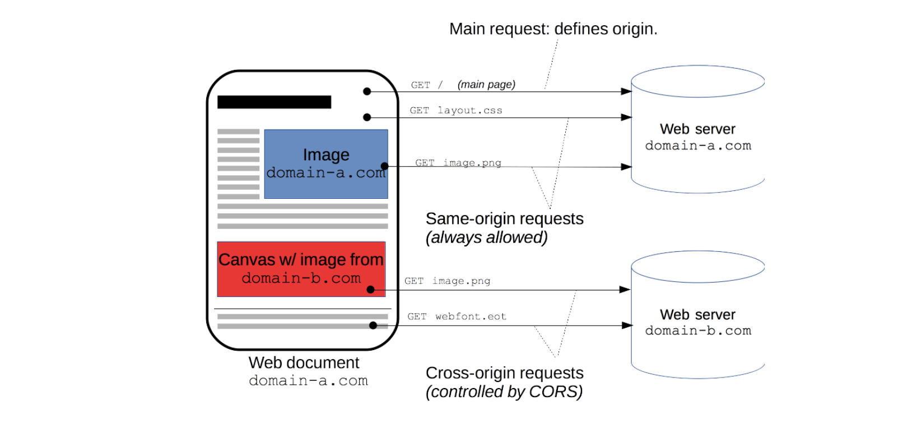

## CORS
CORS(Cross-Origin Resource Sharing)는 출처가 다른 자원들을 공유한다는 뜻으로,한 출처에 있는 자원에서 다른 출처에 있는 자원에 접근하도록 하는 개념입니다. 직역하면, 교차되는 출처 자원들의 공유입니다. 다른 출처에 있는 자원을 요청한다고 하면, 이를 교차 출처 요청이라고 부릅니다.

> 교차 출처 리소스 공유(Cross-Origin Resource Sharing, CORS)는 추가 HTTP 헤더를 사용하여, 한 출처에서 실행 중인 웹 애플리케이션이 다른 출처의 선택한 자원에 접근할 수 있는 권한을 부여하도록 브라우저에 알려주는 체제입니다. 웹 애플리케이션은 리소스가 자신의 출처(도메인, 프로토콜, 포트)와 다를 때 교차 출처 HTTP 요청을 실행합니다.

## 출처

위의 구성요소 중에서 Protocol + Host + Port 3가지가 같으면 동일 출처(Origin)라고 합니다.

다른 출처 요청일 경우, CORS 정책에 준수하여 요청해야만 정상적으로 응답을 받습니다.

## 다른 출처 요청의 위험성 

img, script, frame, video, audio 등이 웹에 등장하면서, 페이지 로딩 이후에 브라우저에서 이러한 하위 자원들을 가져올 수 있게 되었습니다. 그러므로 동일 출처, 다른 출처 모두 호출이 가능하게 되었습니다

CORS 정책이 없고 모든 다른 출처 요청이 가능한 브라우저를 생각해봅시다.

홈페이지를 서핑하고 있는데, scrpit가 심어진 evil.com 페이지를 열었다고 가정해봅시다. 굉장히 유용한 정보를 담고 있는 사이트이지만, 페이지를 열면 scrpit가 실행되어 은행 'delete/account'를 요청하도록 되어 있습니다. ajax 호출로 은행 api를 호출하여 나의 은행 계좌를 삭제해버리는 사고가 발생합니다.

따라서, 다른 출처의 접근을 막기 위해서 동일 출처 정책이 등장했습니다.

## 동일 출처 정책

동일 출처 정책은 다른 출처로부터 조회된 자원들의 읽기 접근을 막아 다른 출처 공격을 예방합니다. 그러나, 다른 출처에서 얻은 이미지를 담는 img, 외부 주소를 담는 link 같은 여러 태그들을 허용합니다. 동일 출처 정책의 정확한 구현 명세는 없지만 최신의 브라우저들은 일정 규칙을 따르고 있습니다. (RFC6454)

동일출처 정책을 다른 출처 자원을 가져오는 것을 굉장히 제한적으로 허용했습니다. 또한 SPA와 미디어 중심 웹 사이트들이 더욱 늘어나고 있으므로 관련 규칙들도 계속 늘어납니다. 따라서, 다른 출처 리소스에 접근성을 높이기 위해서 CORS가 등장했습니다.

## 동일 출처 요청 vs 다른 출처 요청 그림

동일 출처 요청과 다른 출처 요청이 어떻게 다른지 그림을 통해서 비교해보겠습니다.

요청하는 클라이언트와 요청받는 서버가 같은 출처에 있으면 동일 출처, 서로 다른 서버에 있으면 다른 출처 요청입니다.

왼쪽의 핸드폰의 URL은 domain-a.com 입니다.

오른쪽 서버의 URL은 domain-a.com과 domain-b.com 2가지 입니다.

domain-a.com 유저가 domain-a.com 서버에 요청하면 동일 정책이기 때문에 아무런 문제가 없지만,
domain-a.com 유저가 domain-b.com 서버에 요청하면 호스트(Host_가 다르기 때문에 다른 출처 요청을 합니다

 

도메인 이외에, 같은 프로젝트 내에 정의된 css 파일 요청은 동일 출처 요청이고,

font같은 경우에는 다른 외부 사이트에서 실시간으로 import를 통해 가져온다면 다른 출처 요청입니다.

이처럼, 같은 출처가 아닌 외부에 자원을 요청하는 경우가 있는지 잘 확인해보아야 합니다.

 

기본적으로 동일 출처 요청만 자유롭게 요청이 가능하며 동일 출처 정책(Same-Origin Policy) 이라고 합니다.

하지만 기준을 완화하여 다른 출처 요청도 할 수 있도록 기준을 만든 체제가 다른 출처 정책(Cross-Origin Policy)입니다.

## 다른 출처 요청 정책 3가지

다른 출처 요청 정책 3가지를 알아보겠습니다. 단순요청(Simple Request), 프리플라이트 요청(Preflighted Request), 인증정보요청(Credential Request) 입니다.

 

 