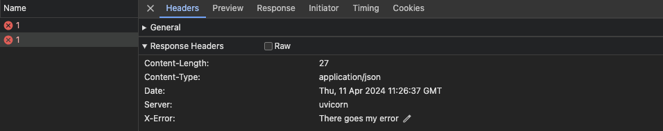

## Handling Errors

예외처리에 대한 내용
- 만약 클라이언트가 접근할 수 없는 자원에 접근
- 존재하지 않는 자원에 접근
- 권한 자체가 없는 경우

일반적으로 400범위의 에러를 발생

```
from fastapi import FastAPI, HTTPException

app = FastAPI()

items = {"foo": "The Foo Wrestlers"}


@app.get("/items/{item_id}")
async def read_item(item_id: str):
    if item_id not in items:
        raise HTTPException(status_code=404, detail="Item not found")
    return {"item": items[item_id]}
```

### Add custom headers

```
from fastapi import FastAPI, HTTPException

app = FastAPI()

items = {"foo": "The Foo Wrestlers"}


@app.get("/items-header/{item_id}")
async def read_item_header(item_id: str):
    if item_id not in items:
        raise HTTPException(
            status_code=404,
            detail="Item not found",
            headers={"X-Error": "There goes my error"},
        )
    return {"item": items[item_id]}
```



### Install custom exception handlers

```
from fastapi import FastAPI, Request
from fastapi.responses import JSONResponse


class UnicornException(Exception):
    def __init__(self, name: str):
        self.name = name


app = FastAPI()


@app.exception_handler(UnicornException)
async def unicorn_exception_handler(request: Request, exc: UnicornException):
    return JSONResponse(
        status_code=418,
        content={"message": f"Oops! {exc.name} did something. There goes a rainbow..."},
    )


@app.get("/unicorns/{name}")
async def read_unicorn(name: str):
    if name == "yolo":
        raise UnicornException(name=name)
    return {"unicorn_name": name}
```

name이 yolo 일 시 강제로 에러를 발생시키고 이를 exception_handler가 받아서 처리

### Override the default exception handlers

```
from fastapi import FastAPI, HTTPException
from fastapi.exceptions import RequestValidationError
from fastapi.responses import PlainTextResponse
from starlette.exceptions import HTTPException as StarletteHTTPException

app = FastAPI()


@app.exception_handler(StarletteHTTPException)
async def http_exception_handler(request, exc):
    return PlainTextResponse(str(exc.detail), status_code=exc.status_code)


@app.exception_handler(RequestValidationError)
async def validation_exception_handler(request, exc):
    return PlainTextResponse(str(exc), status_code=400)


@app.get("/items/{item_id}")
async def read_item(item_id: int):
    if item_id == 3:
        raise HTTPException(status_code=418, detail="Nope! I don't like 3.")
    return {"item_id": item_id}
```

```
{
    "detail": [
        {
            "loc": [
                "path",
                "item_id"
            ],
            "msg": "value is not a valid integer",
            "type": "type_error.integer"
        }
    ]
}
```

RequestValidationError는 Pydnantic의 ValidationError의 서브 클래스다.

Pydantic의 response_model을 사용했는데, 데이터 에러가 발생할 시 로그를 통해 오류를 볼 수 있지만 클라이언트, 사용자는 이걸 볼 수 없다.

대신에 500이라는 HTTP status code를 보게 된다. 이는 ValidationError가 코드 어딘가에 있기 때문이라고 한다.

위의 오류에 해당하는 내용을 수정하는 동안에는 클라이언트/사용자는 오류에 대한 내부 정보에 접근할 수 없게 해야한다. 보안 취약성이 노출될 수 있기 때문이다.

### Use the RequestValidationError body

```
from fastapi import FastAPI, Request, status
from fastapi.encoders import jsonable_encoder
from fastapi.exceptions import RequestValidationError
from fastapi.responses import JSONResponse
from pydantic import BaseModel

app = FastAPI()


@app.exception_handler(RequestValidationError)
async def validation_exception_handler(request: Request, exc: RequestValidationError):
    return JSONResponse(
        status_code=status.HTTP_422_UNPROCESSABLE_ENTITY,
        content=jsonable_encoder({"detail": exc.errors(), "body": exc.body}),
    )


class Item(BaseModel):
    title: str
    size: int


@app.post("/items/")
async def create_item(item: Item):
    return item
```

```
{
  "title": "towel",
  "size": "XL"
}
```

```
{
  "detail": [
    {
      "loc": [
        "body",
        "size"
      ],
      "msg": "value is not a valid integer",
      "type": "type_error.integer"
    }
  ],
  "body": {
    "title": "towel",
    "size": "XL"
  }
}
```

#### FastAPI’s HTTPException vs Starlette’s HTTPException
FastAPI는 자체적인 HTTPException을 가지고 있다. 이것은 Starlette’s의 HTTPException을 상속받은 것이다.

다른점은 FastAPI의 HTTPException은 response에 헤더를 추가하는것이 허용된다는 것이다. 이는 OAuth 2.0이나 몇몇 보안 툴에 쓰인다고 한다.

고로 FastAPI의 HTTPException을 사용하는게 좋다고 한다.

그러나 만약 예외처리 핸들러가 필요하다면 Starlette’s의 HTTPException을 사용하라고 한다.

왜냐하면 Starlett가 가지고 있는 내부코드나 외부 플러그인을 통해서 Starlette의 HTTPException을 발생시키는데, 이 과정에서 작성한 예외 핸들러를 찾고 실행할 수 있기 때문이라고 한다.

### Re-user FastAPI's exception handlers

만약 기본 예외처리기를 함께 예외를 사용하려면 from fastapi.exception_hanlers를 통해 기본예외처리기를 사용할 수 있다.

```
from fastapi import FastAPI, HTTPException
from fastapi.exception_handlers import (
    http_exception_handler,
    request_validation_exception_handler,
)
from fastapi.exceptions import RequestValidationError
from starlette.exceptions import HTTPException as StarletteHTTPException

app = FastAPI()


@app.exception_handler(StarletteHTTPException)
async def custom_http_exception_handler(request, exc):
    print(f"OMG! An HTTP error!: {repr(exc)}")
    return await http_exception_handler(request, exc)


@app.exception_handler(RequestValidationError)
async def validation_exception_handler(request, exc):
    print(f"OMG! The client sent invalid data!: {exc}")
    return await request_validation_exception_handler(request, exc)


@app.get("/items/{item_id}")
async def read_item(item_id: int):
    if item_id == 3:
        raise HTTPException(status_code=418, detail="Nope! I don't like 3.")
    return {"item_id": item_id}
```
