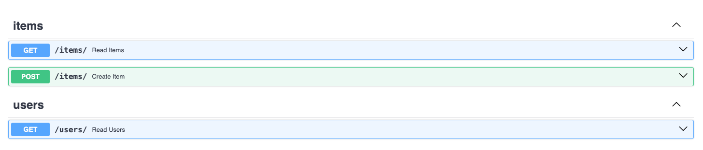
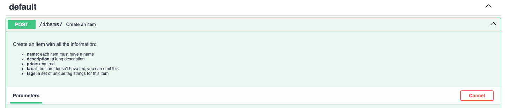
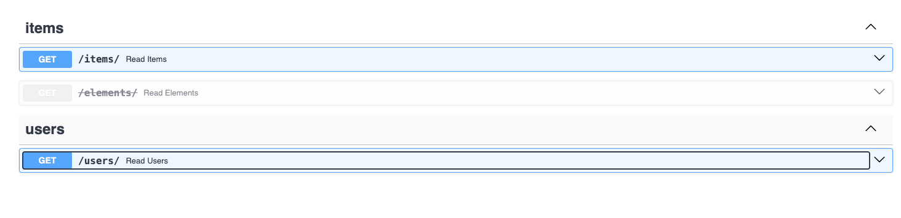

## 경로 작동 설정
경로 작동 데코레이터를 설정하기 위해서 전달할 수 있는 몇 가지 매개변수가 있습니다.

### 응답 상태 코드

경로 작동의 응답에 사용될 (HTTP) status_code 를 정의할 수 있습니다.

404와 같은 int형 코드를 직접 전달할 수 있습니다.

하지만 각 코드의 의미를 모른다면, status에 있는 단축 상수들을 사용할 수 있습니다.

```
from typing import Set, Union

from fastapi import FastAPI, status
from pydantic import BaseModel

app = FastAPI()


class Item(BaseModel):
    name: str
    description: Union[str, None] = None
    price: float
    tax: Union[float, None] = None
    tags: Set[str] = set()


@app.post("/items/", response_model=Item, status_code=status.HTTP_201_CREATED)
async def create_item(item: Item):
    return item
```

각 상태 코드들은 응답에 사용되며, OpenAPI 스키마에 추가됩니다.

## 태그

str로 구성된 list 와 함께 매개변수 tags를 전달하여, 경로 작동에 태그를 추가할 수 있습니다.

```
from typing import Set, Union

from fastapi import FastAPI
from pydantic import BaseModel

app = FastAPI()


class Item(BaseModel):
    name: str
    description: Union[str, None] = None
    price: float
    tax: Union[float, None] = None
    tags: Set[str] = set()


@app.post("/items/", response_model=Item, tags=["items"])
async def create_item(item: Item):
    return item


@app.get("/items/", tags=["items"])
async def read_items():
    return [{"name": "Foo", "price": 42}]


@app.get("/users/", tags=["users"])
async def read_users():
    return [{"username": "johndoe"}]
```



## 요약과 기술

summary 와 description 을 추가할 수 있습니다.

```
from typing import Set, Union

from fastapi import FastAPI
from pydantic import BaseModel

app = FastAPI()


class Item(BaseModel):
    name: str
    description: Union[str, None] = None
    price: float
    tax: Union[float, None] = None
    tags: Set[str] = set()


@app.post(
    "/items/",
    response_model=Item,
    summary="Create an item",
    description="Create an item with all the information, name, description, price, tax and a set of unique tags",
)
async def create_item(item: Item):
    return item
```


## 독스트링으로 만든 기술

설명은 보통 길어지고 여러 줄에 걸쳐있기 때문에, 경로 작동 기술을 함수 독스트링에 선언할 수 있습니다, 이를 FastAPI가 독스트링으로부터 읽습니다.

```
from typing import Set, Union

from fastapi import FastAPI
from pydantic import BaseModel

app = FastAPI()


class Item(BaseModel):
    name: str
    description: Union[str, None] = None
    price: float
    tax: Union[float, None] = None
    tags: Set[str] = set()


@app.post("/items/", response_model=Item, summary="Create an item")
async def create_item(item: Item):
    """
    Create an item with all the information:

    - **name**: each item must have a name
    - **description**: a long description
    - **price**: required
    - **tax**: if the item doesn't have tax, you can omit this
    - **tags**: a set of unique tag strings for this item
    """
    return item
```



### 응답 기술

response_description 매개변수로 응답에 관한 설명을 명시할 수 있습니다.

```
from typing import Set, Union

from fastapi import FastAPI
from pydantic import BaseModel

app = FastAPI()


class Item(BaseModel):
    name: str
    description: Union[str, None] = None
    price: float
    tax: Union[float, None] = None
    tags: Set[str] = set()


@app.post(
    "/items/",
    response_model=Item,
    summary="Create an item",
    response_description="The created item",
)
async def create_item(item: Item):
    """
    Create an item with all the information:

    - **name**: each item must have a name
    - **description**: a long description
    - **price**: required
    - **tax**: if the item doesn't have tax, you can omit this
    - **tags**: a set of unique tag strings for this item
    """
    return item
```


### 단일 경로 작동 지원중다

단일 경로 작동을 없애지 않고 지원중단을 해야한다면, deprecated 매개변수를 전달하면 됩니다.

```
from fastapi import FastAPI

app = FastAPI()


@app.get("/items/", tags=["items"])
async def read_items():
    return [{"name": "Foo", "price": 42}]


@app.get("/users/", tags=["users"])
async def read_users():
    return [{"username": "johndoe"}]


@app.get("/elements/", tags=["items"], deprecated=True)
async def read_elements():
    return [{"item_id": "Foo"}]
```


