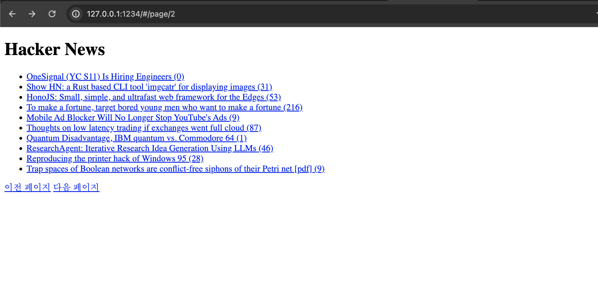
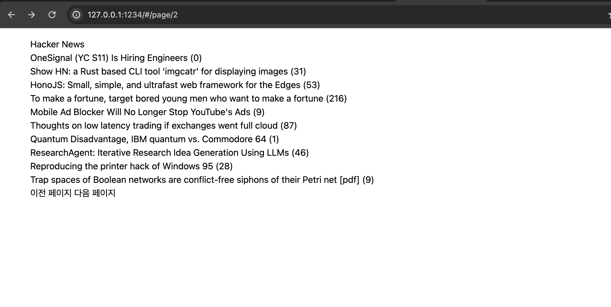

## tailwindcss

https://tailwindcss.com/docs/installation/play-cdn

css를 간단한 추가만으로 사용할 수 있다.
```
<!doctype html>
<html>
<head>
    <meta charset="utf-8">
    <meta name="viewport" content="width=device-width, initial-scale=1, shrink-to-fit=no">
    <title>HN client</title>
    <link href="https://unpkg.com/tailwindcss@^2/dist/tailwind.min.css" rel="stylesheet">
</head>
<body>
    <noscript>
        you need to enable javascript to run this app
    </noscript>
    <div id="root">
    </div>
    <script src="app.js" type="module"></script>
</body>
</html>
```

` <link href="https://unpkg.com/tailwindcss@^2/dist/tailwind.min.css" rel="stylesheet">`

index.html에 간단한 코드 추가만으로 tailwindcss를 사용할 수 있다.

< before >


< after >
