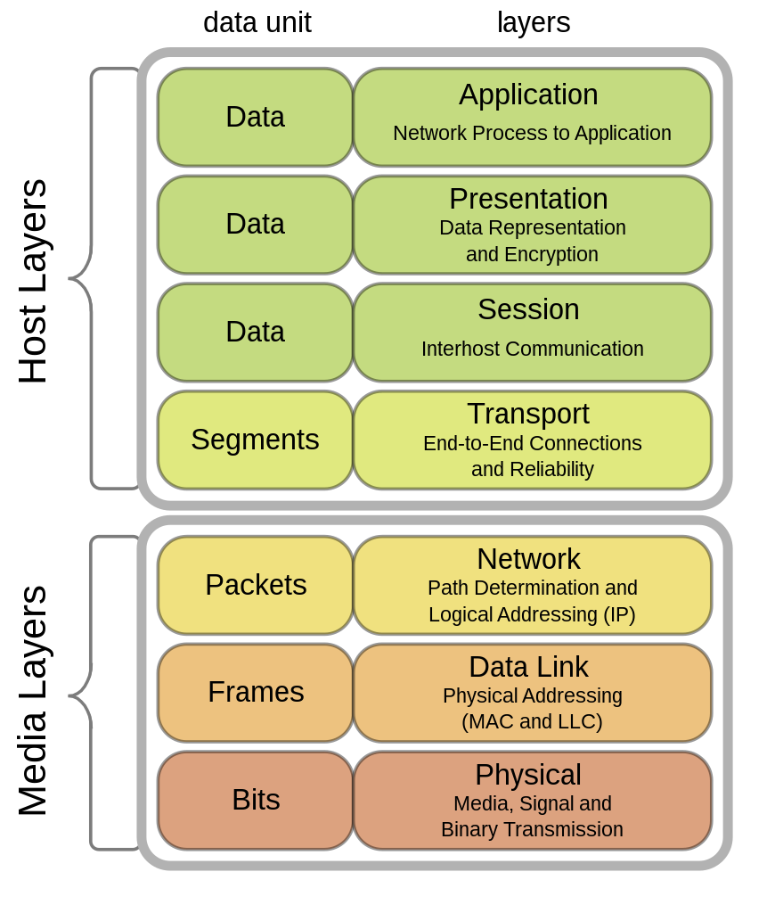

>   ### 패킷
>   패킷(Packet)이란 네트워크를 통해 전송하기 쉽도록 자른 데이터의 전송단위로, 데이터의 형식화된 블록이다. 패킷은 헤더(제어 정보)와 페이로드(사용자 데이터), 트레일러로 이루어지며, 헤더는 주로 패킷의 수신지와 관련된 정보가 포함되고 트레일러에는 에러 정보가 포함된다. 만약 시스템이 패킷을 지원하지 않는다면 바이트와 문자열, 비트를 독립적으로 전송해야 하므로 효율성과 안정성이 떨어진다.

다음은 네트워크에서 데이터를 전송할 때 패킷이 조합되는 과정으로, TCP/IP 모델을 기준으로 설명한 것이다.

- 먼저 최상위 계층인 응용 계층에서 전송 계층으로 페이로드를 넘긴다.
- 전송 계층에서는 응용 계층에서 건네받은 페이로드에 헤더를 추가한 뒤 인터넷 계층으로 넘긴다.
- 인터넷 계층에서는 전송 계층에서 건네받은 페이로드와 헤더를 페이로드로 삼아 그 앞에(반드시 '앞'이어야 한다) 다시 헤더를 붙이고 최하위 계층인 네트워크 액세스 계층으로 넘긴다.

이런 식으로 페이로드에 헤더를 붙이는 과정을 캡슐화라고 하며, 데이터를 수신하는 쪽에서는 건네받은 패킷을 해제하며 데이터를 확인하는 역캡슐화를 수행한다. 역캡슐화는 캡슐화와 반대로 하위 계층에서 상위 계층의 방향으로 진행된다.

위 설명에서도 알 수 있듯 패킷을 구성하는 헤더와 페이로드는 계층에 따라 바뀐다. 따라서 계층마다 패킷을 지칭하는 용어도 따로 있으며, 이를 통칭해서 프로토콜 데이터 단위라고 한다.

### 2. 프로토콜 데이터 단위(PDU)
프로토콜 데이터 단위(Protocol Data Unit, PDU)는 이름 그대로 프로토콜의 데이터 단위를 뜻한다. 패킷과 의미가 비슷하기 때문에 헷갈릴 수 있는데, 패킷이 네트워킹에서의 모든 데이터 단위라면 PDU는 네트워크 계층에서의 패킷이다. 즉, '헤더 + 페이로드'를 좀 더 직접적으로 지칭하는 용어인 것이다.

